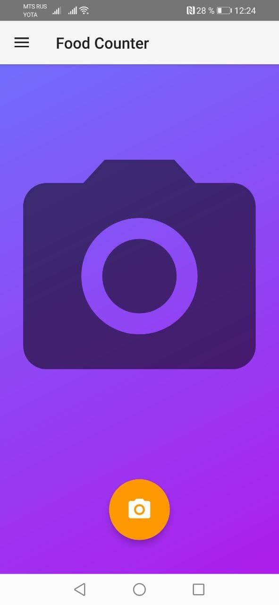
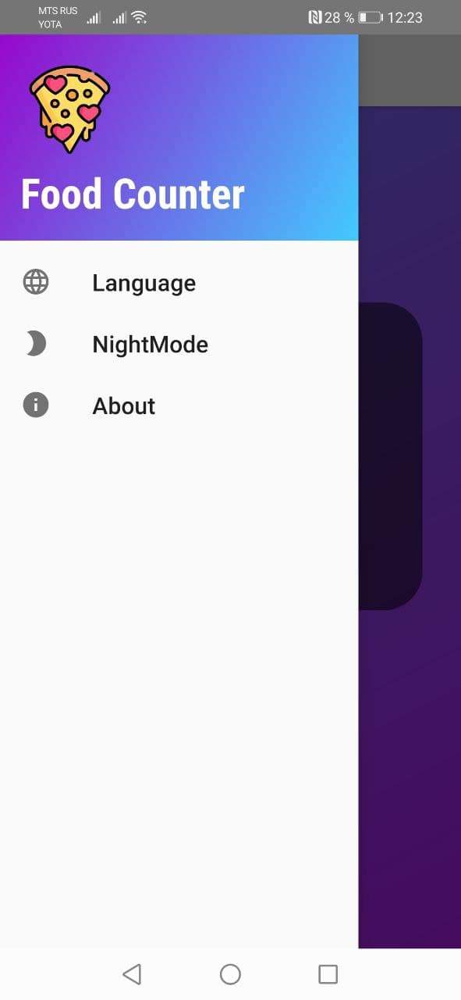
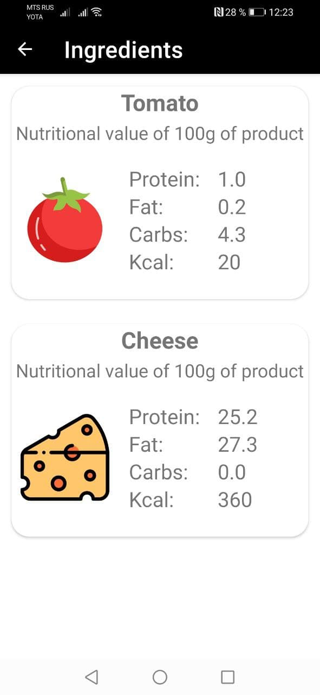

# Food Counter

Приложение распознаёт ингредиенты по фотографии и выводит их пищевую ценность.\
На данный момент приложение распознаёт только 2 ингредиента: помидор и сыр.

Распознавание предметов реализовано с помощью библиотеки TensorFlow Lite.\
Реализовано 4 языка: русский, английский, немецкий и японский.\
Можно выбрать светлую или тёмную тему.

При первом запуске (пока пользователь видит splash screen) с сервера парсятся данные (название ингредиента, ссылка на фотографию, жир, белок, углеводы и калории) в базу данных SQLite.\
Ссылка на сервер:
https://peaceful-garden-62887.herokuapp.com/list_all

Это реализовано с целью уменьшения времени установки приложения с Play Market.\
Сам сервер на Heroku с применением СУБД PostgreSQL.

Когда распознаётся пища, то с помощью библиотеки picasso проихсодит конвертация из ссылки в нарисованную фотографию (третий скриншот ниже).\
Если приложение было хотя бы 1 раз запущено с корректным интернет соединением, то в дальнейшем использовании рабочая, быстрая связь не обязательна.
То есть пользовтель может следить за своим здоровьем даже без связи на телефоне.

 

 

